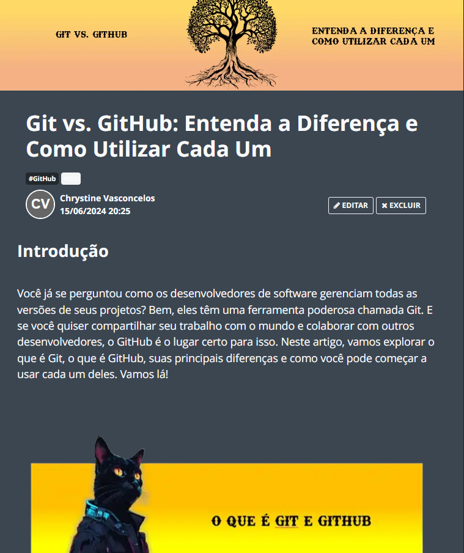

# Article Project Generated by AI

> ℹ️ **NOTE:** This repository was created as part of the Santander 2024 course - Fundamentals of AI for Developers on the [DIO](https://dio.me) platform.

Projeto com o objetivo de gerar um artigo técnico com um layout rico, leitura agradável e com foco em promover sua autoridade técnica.

 

<a href="https://web.dio.me/articles/git-vs-github-entenda-a-diferenca-e-como-utilizar-cada-um?back=%2Farticles&page=1&order=oldest"> 📃 Clique aqui para ler o artigo</a>

 

 

## 🛠️ Tools Utilized:

- Conteúdo gerado via: [ChatGPT](https://chat.openai.com/)
- Imagens geradas via: [Lexica.art](https://lexica.art/)
- Criação do artigo via [PowerPoint.](https://www.microsoft.com/en/microsoft-365/powerpoint)

 

ChatGPT：

|   Ação   | Prompt                                                                                        |
| :------: | --------------------------------------------------------------------------------------------- |
|  Título  | Crie 10 headlines para nomes de artigos sobre o assunto Git e GitHub                          |
| conteúdo | Crie um artigo sobre Git e GitHub, listando os principais comandos com exemplos nas {REGRAS}. |

Lexica.art：

- Foi utilizado o acervo público de imagens geradas por outras pessoas.
